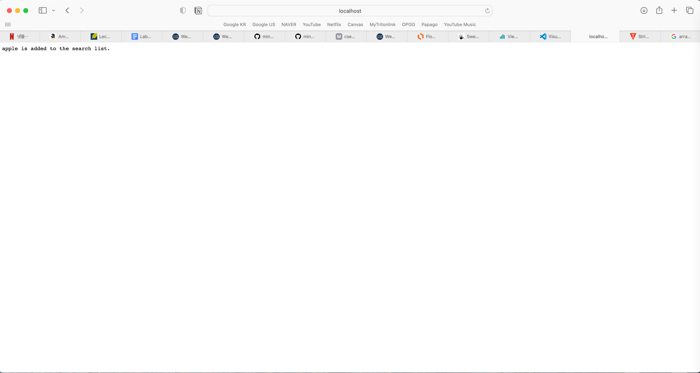

Part 1: SearchEngine

```
import java.io.IOException;
import java.net.URI;
import java.util.ArrayList;

class Handler implements URLHandler {
    // The one bit of state on the server: a number that will be manipulated by
    // various requests.
    int num = 0;
    ArrayList<String> words = new ArrayList<String>();

    public String handleRequest(URI url) {
        String[] parameters = url.getQuery().split("=");
        ArrayList<String> searchedWords = new ArrayList<String> ();

        if (url.getQuery().contains("s")){
            if (url.getPath().contains("/add")) {
            words.add(parameters[1]);
            return parameters[1] + " is added to the search list.";

            }
            if((url.getPath().contains("/search"))){
                for(int i = 0; i < words.size(); i += 1){
                    if (words.get(i).contains(parameters[1])){
                        searchedWords.add(words.get(i));
                    }
                }
                if (searchedWords.size() != 0) {
                String wordList = "";
                for (int i = 0; i < searchedWords.size(); i += 1) {
                    wordList = wordList + " " + searchedWords.get(i);
                }
                return wordList;
                }
            }
        }
        return "404 Not Found!";
        }
    }


class searchEngine {
    public static void main(String[] args) throws IOException {
        if(args.length == 0){
            System.out.println("Missing port number! Try any number between 1024 to 49151");
            return;
        }

        int port = Integer.parseInt(args[0]);

        Server.start(port, new Handler());
    }
}
```



- /add?s=apple is attached at the end of URL to add the 'apple' into the searchlist. getPath() method will extract URL in string data type. Since getQuery() method takes the part of URL after the question mark, 's = apple' will be returned as a result. From this string, split method splits the string into two parts by '=' sign and will store those splitted string in the list named parameters. From this parameter list,
  
- /add?s=pineapple is used in this step to add pineapple into the searchlist. And the same procedure occurs to add pineapple.
  
- For adding step, the code tries to determine whether /add is contained in URL or not, but for searching, it now tries to find /search in URL. If /search is contained, it does the same thing as adding step, using getQuery() and split by '='. Anything comes after the equal sign will be used for search. In this case, /search?s=app means any words that contain 'app' will be returned as the search result.

Overall Summary:

- I used getPath and getQuery to extract the information from URL and other arraylist methods to utilize the information in arraylist. handleRequest method allows the user to access on URL directly. getQuery method gets the data after question mark, so if there is no question mark in URL, the website will display 404 Not Found!. Parameter list contains two elements that are consisted of [s, (contents after '=')]. Contents after '=' comes from the user and will be stored in arraylist to be searched. The URL that contains /add will pul user input as a parameter[1], and /search will put what the user try to search as a parameter[1].

Part 2: Bugs And Symptoms
ArrayTests:


- input that causes the bug.
- test fails in testReverseInPlace3()
  
- code that causes the symptom
- expected [4,3,2,1], actual [4,3,3,4]
- while the expected result has a complete flipped version of input, actaul result provides the mirrored version of input.
  
- This is fixed version of code. The bug occurs when the last half of the elements tries to overwrite it. Since last half of array take the values from the first half of array, the first half of the elements should not be manipulated. However, it is manipulated and produces the wrong output. To fix this, I implemented the swap algorithm.

ListTests:


- this photo provides the code that causes the error and output.
- expected [a,x,y,z], actual Java heap space error
  
  
- the code that used to cause the error and fixed version of it. Previous: index1 += 1
  Fixed: index2 += 1
- the bug occurs because while loop for list2 doesn't get ended since index1 is incremented. After changing index1 into index2, while loop now can break itself in order to not cause the memory error.
