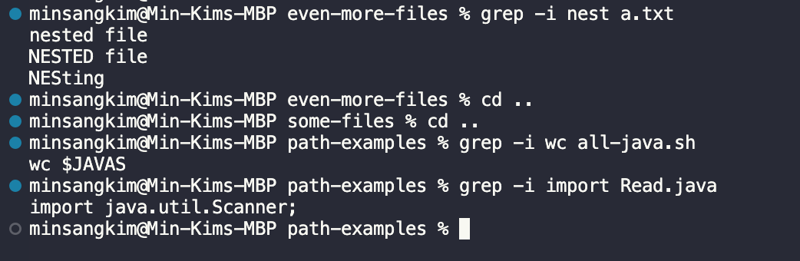
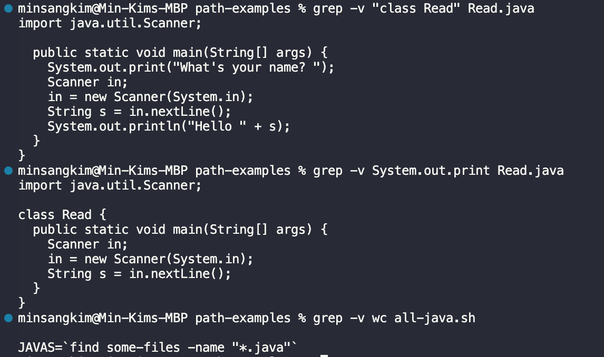
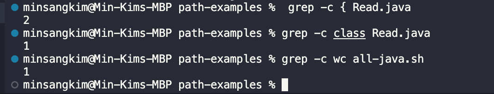

1. grep -i [string] [file name]

- this command-line option, -i, displays the line that contains [string] in the file, regardless of lower or upper case.
- this is useful when I'm trying to find a specific variable in the code. By putting variable name into string argument of command, we can see what line takes that variable.

  

2. grep -v [string] [file name]

- it used to display the lines which do not match with the given string.
- it is useful to see the original code when I'm working on println() debugging. By putting System.out.print into the argument, we will be able to see the rest of the code that does not include System.out.print.

  

3. grep -c [string] [file name]

- it counts the number of lines that contain the given string
- it is useful in various areas, like to count the number of class in code, and number of indent the code contains. Also, it is useful to count the number of command used in bash file.

  
