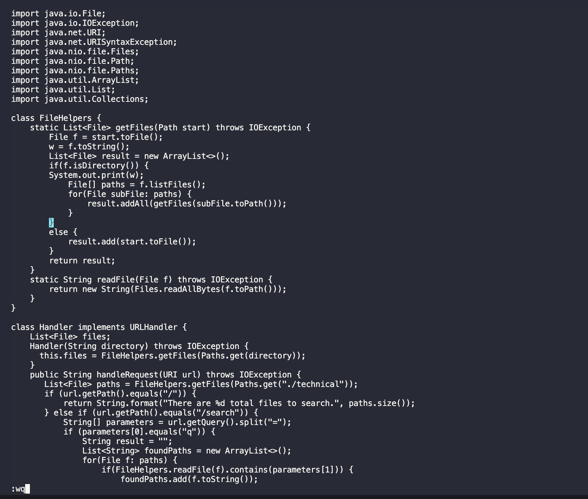

Part 1: Vim 30 key strokes limitation

- Initializing a variable named 'w' which contains a sentence, "it's a directory:" + f.toString(), so that I can minimize the argument length. After that, the following sentence will tell the sequence of key strokes. Its total number of strokes is 30.

/[bbi<Enter>System.out.print(w);<ESC>:wq

Pressing /[ to move the cursor to where File[] is located.

Press b twice to move the cursor backward so that I can move the cursor to the previous line of File[] line. After that, press i to enter Insert mode and <Enter> to make a new line.

From this newly made line, type in System.out.print(w);, w is a variable that stores f.toString().

Lastly, quit Insert mode by pressing <ESC> and type :wq to save and quit.

- First, /[ will search File[] with the least number of key strokes since File[] is the first lane that uses []. Pressing b twice will move the cursor to the end of the previous line, and pressing i will allow user to edit the text by switching to insert mode. After getting into insert mode, <Enter> moves the cursor to the next new lane and now we type print statement. When I'm done with typing, <ESC> command quits to normal mode. Lastly, :wq will save the changes and quit.

Part 2: Working on remote environment

- Using scp command: it took about 57 seconds to complete it.
- Using Vim in ssh server: it took about 1 min 21 sec to complete it.

Nothing was difficult for me to work on these two stratigies.

Q. Which of these two styles would you prefer using if you had to work on a program that you were running remotely, and why?

- Using scp command saves more time for me since it is more familiar than Vim. Vim requires me to think of what Vim commands work the best in this situation, so it takes little more time comparing to scp command.

Q. What about the project or task might factor into your decision one way or another? (If nothing would affect your decision, say so and why!)

- If I need to work on the remote for the most of times, then I think I will use Vim since I need to log myself out from the server to use scp command. For every time when I want to modify some parts of the codes, I have to log out and this is inefficient.
