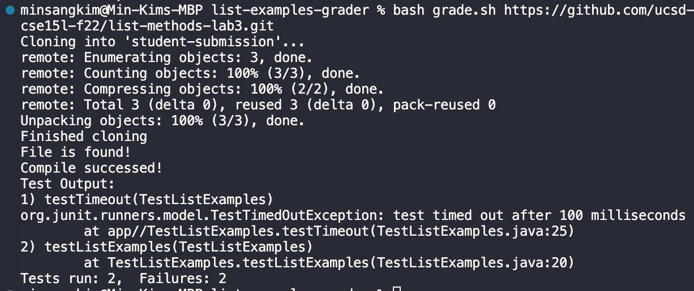
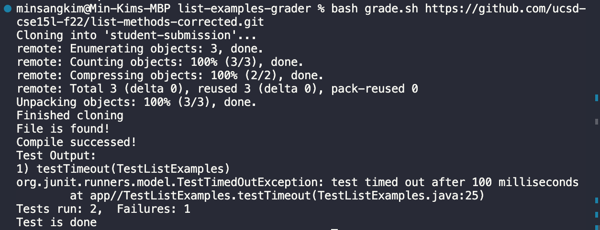
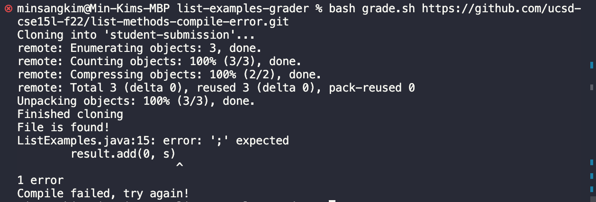

1. grade.sh Code Block

rm -rf student-submission
git clone $1 student-submission
echo 'Finished cloning'

if [ -f ./student-submission/ListExamples.java ]
then
echo "File is found!"
else
echo "No file is found..."
exit 1
fi

cp TestListExamples.java student-submission
cp -r ./lib ./student-submission
cd student-submission

javac -cp .:lib/hamcrest-core-1.3.jar:lib/junit-4.13.2.jar \*.java

if [ $? -eq 0 ]
then
echo "Compile successed!"
else
echo "Compile failed, try again!"
exit 1
fi

java -cp .:lib/hamcrest-core-1.3.jar:lib/junit-4.13.2.jar org.junit.runner.JUnitCore TestListExamples > grade.txt

echo "Test Output:"
grep -i "test" grade.txt

echo "Test is done"

Part 2: Tracing the code
(Somehow I could not load my result on the web, I temporarilly substitute the result into VS Code terminal result)

Original version

Corrected version

Compile-error version

I will take Compile-error version of screenshot to analyze through the script.

- First, at the beginning of the code, rm -rf removes student-submission that existed before to receive a newly cloned student submission folder. Hence, Stdout and Stderr will be empty since they are simply removing. Similarly, the following git clone code will not produce a specific output to stdout and stderr with the same reason. echo "Finished cloning" will put "Finished cloning" into stdout. For the first if statement, it checks whether the file is properly submitted into desginated directory. If it is not submitted properly, it will echo "No file is found..." In this case, the file is correctly submitted, so it will echo "File is found!" This will be stdout. As following, the line that contains command line will work silently, so they wouldn't produce anything into stdout and stderr. At the second if statement, the code encounters the compiler error and moves to else statement to echo "Compile failed, try again!" This is stdout.

- For the first if statement, it is true since the file can be found in student-submission through git clone line. But the second if statement, it returns false because the student-submission file has compile error.

- The first if statement that checks the file submission will run. However, the second if statement that checks the compile will produce error since student-submission contains compile-error-inducing codes.
