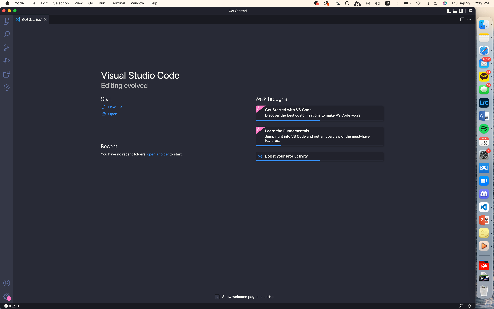
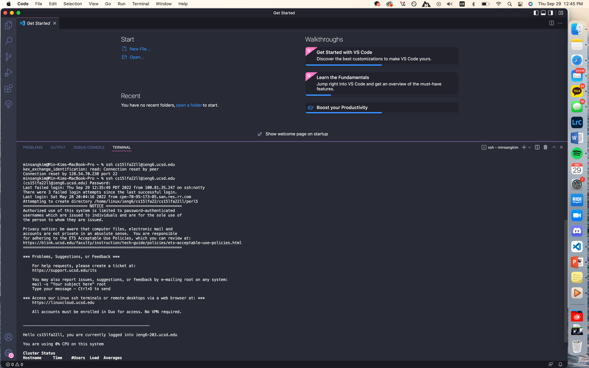
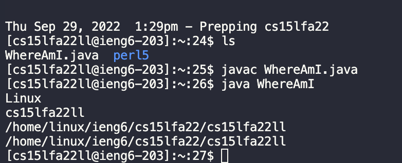
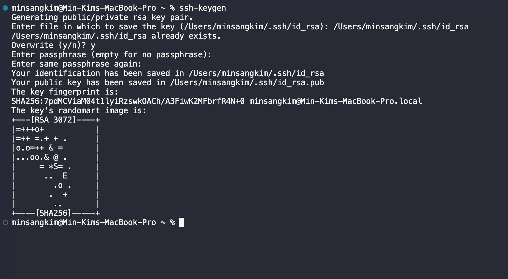
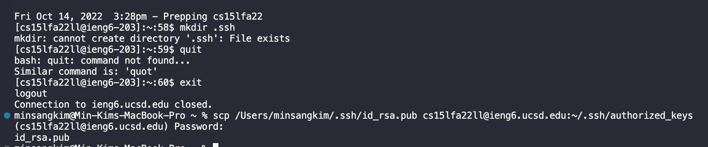
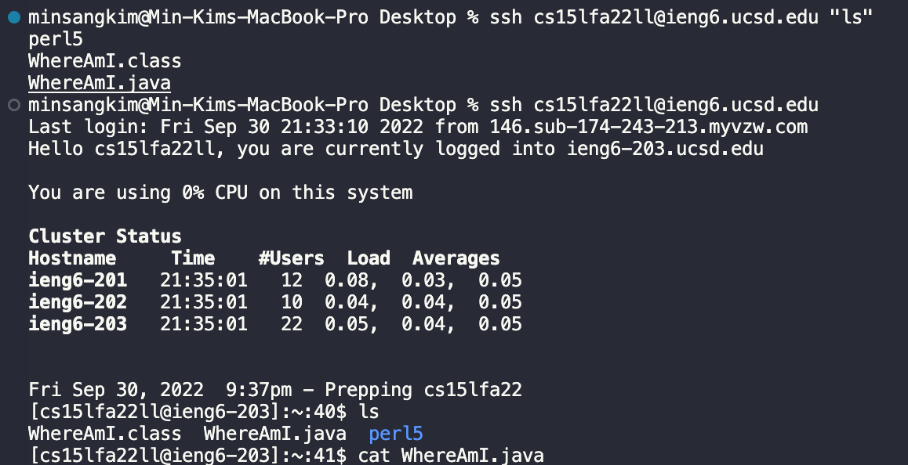

Part 1: Installing VS Code

This part shows the installation of VS Code. Dive into VS Code website to download the launcher. https://code.visualstudio.com After downloading it, we can import the existing poject from the local computer, or we can craete a complete new project.

Part 2: Remotedly Connecting

This part shows the connection to ieng6 server by using ssh command. ssh command allows user to be connected through online so that user can access to the files. By putting ssh command at the front and writing ID and server after ssh (like ssh cs15lfa22ll@ieng6.ucsd.edu), users can remotedly access to the files and projects that are uploaed on server. In this case, cs15lfa22ll will be my user name or ID.

Part 3: Trying Some Commands

By utilizing some commands, I could know how they work. ls command shows the contents inside the current directory, and pwd command shows the path. cat command displays the content inside of the current file. Lastly, cd changes the current directory to directory comeing after cd command. Also, as this commands are so common in the most of the case, I don't think copying and pasting them would not take that long.

Part 4: Moving Files With scp

scp command allows user to upload or download file from local drive to the server. This even can enforce the power of online connection. Way to use scp command is like "scp 'file name' 'server'". In this case, WhereAmI.java would be the file name and what I try to upload on the server, and cs15lfa22ll@ieng6.ucsd.edu:~/ would be server where the file being uploaded.

Part 5: Setting an SSH Key

Everytime when the user tries to login to the server, this is quite time consuming. Creating a ssh key does save the time for the user on logging in procedure. It saves about 15 sec, this seems not to long but gets larger as accumulated. First, we create the key that allows the user to access to the server without login procedure in the local drive. Following after, login to the server through ssh command, and we create a coresponding key in the server in order to match it with local key. After creating the server key, the user now can login to the server by ssh without password.

Part 6: Optimizing Remote Running

This command shows what's in the server without logging into it: saving time. It only takes 5-6 keystrokes.
