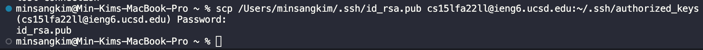

Part 1: Installing VS Code

This part shows the installation of VS Code.

Part 2: Remotedly Connecting

This part shows the connection to ieng6 server by using ssh command. ssh command allows user to be connected through online so that user can access to the files. The most of the things in screenshot are the same with what the peers did.

Part 3: Trying Some Commands

By utilizing some commands, I could know how they work. ls command shows the contents inside the current directory, and pwd command shows the path. Also, as this commands are so cmmon in the most of the case, I don't think copying and pasting them would not take that long.

Part 4: Moving Files With scp

scp command allows user to upload or download file from local drive to the server. This even can enforce the power of online connection.

Part 5: Setting an SSH Key

Everytime when the user tries to login to the server, this is quite time consuming. Creating a ssh key does save the time for the user on logging in procedure. It saves about 15 sec, this seems not to long but gets larger as accumulated.

Part 6: Optimizing Remote Running

This command shows what's in the server without logging into it: saving time. It only takes 5-6 keystrokes.
